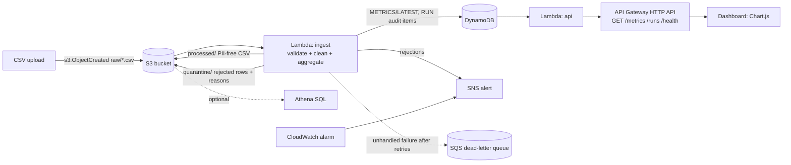

# DealerPulse: Serverless Sales & CRM Analytics Pipeline

An event-driven AWS pipeline that turns messy dealership lead exports into a clean,
PII-free dataset and a live sales dashboard. Upload a CSV and, seconds later, bad rows are
quarantined with reasons, metrics are computed, and the dashboard updates. There are no
servers to manage.

**Why it exists:** CRM exports in retail are inconsistent: duplicate leads, malformed phone
numbers, impossible dates, labels typed five different ways. I saw this first-hand during a
one-year internship in automotive retail operations, working on CRM data and process
analysis. DealerPulse automates the cleanup and reporting that would otherwise be done by
hand in Excel.

**All data in this repository is synthetic.** No real customer record was used.

---

## Verified on AWS

This is not a design that was only linted. It was deployed to `ap-south-1`, fed a file, and
read back. Raw captures are in [`docs/evidence/`](docs/evidence/).

**Run of 2026-10-06** — input `raw/test_leads.csv`, 61 synthetic rows with deliberate defects:

| Check | Predicted locally | Observed on AWS |
|---|---|---|
| Rows read | 61 | **61** |
| Valid after cleaning | 58 | **58** |
| Rejected, with reasons | 2 | **2** |
| Duplicates removed | 1 | **1** |

Also confirmed end to end:

- **No PII in the output.** The processed file has no `customer_name` column and no raw phone number; every number is masked (`XXXXXX0241`).
- **Nothing dropped silently.** Both rejected rows are in `quarantine/test_leads.errors.json` with their reasons: one row dated in the future, one with a missing lead ID.
- **The public API answers.** `GET /metrics`, `/runs` and `/health` all returned HTTP 200 through API Gateway.
- **No Lambda errors.** No traceback or `ERROR` line in CloudWatch.

**Measured, single run** (one 61-row file, from the CloudWatch `REPORT` line):

| | |
|---|---|
| Duration | 356.98 ms (642 ms billed) |
| Cold start | 284.22 ms |
| Peak memory | 103 MB of 256 MB allocated |

These are single-run numbers, not a load test. Do not quote them as throughput.

---

## Architecture



| Layer | Service | Purpose |
|---|---|---|
| Storage | S3 (encrypted, public access blocked, lifecycle rules) | raw / processed / quarantine zones |
| Compute | Lambda, Python 3.12, arm64 | ingest and read-only API |
| State | DynamoDB on-demand, TTL, PITR | latest metrics + audit trail of runs |
| API | API Gateway HTTP API (throttled) | serves the dashboard |
| Ops | CloudWatch alarm, SNS, SQS DLQ, 14-day log retention | failure visibility |
| IaC / CI | AWS SAM, GitHub Actions (unit + browser tests, cfn-lint) | reproducible deployments |

## What it does

- **Validates every row:** IDs, dates (not in the future, follow-up not before creation), phone numbers (Indian mobile formats normalised), status/source/segment labels (`"test drive"`, `"WALK-IN"` are accepted and normalised), and sale-amount consistency (required when Booked/Delivered, forbidden otherwise, plausible range).
- **Reports every rejection with a reason**, never silently dropping data.
- **De-duplicates** repeated leads, keeping the one with the latest follow-up.
- **Removes personal data before analytics:** customer name and raw phone number never leave `raw/`; processed data carries only a masked phone. Raw files auto-expire after 90 days.
- **Computes:** conversion rate, sales funnel, performance by source / segment / month / salesperson, revenue, average deal value, and a list of leads overdue for follow-up (> 7 days idle).

## Design decisions and trade-offs

These are the choices worth discussing in an interview.

1. **Pure-logic core, thin handlers.** All business rules live in `src/core.py` with no AWS imports, so they are tested in milliseconds. Handlers only do I/O.
2. **Permanent vs transient failures are handled differently.** Bad data (missing columns, bad encoding, oversized file) is quarantined and alerted, and the handler *returns*, because retrying cannot fix it. AWS errors (throttling, network) *raise*, so Lambda retries and the SQS DLQ catches persistent failures.
3. **Idempotent writes.** S3 can deliver an event more than once. Outputs are keyed by file name, so a replay overwrites identical results instead of duplicating them.
4. **Never overwrite good metrics with nothing.** If a file has zero valid rows, `METRICS/LATEST` is kept as is and an alert is raised.
5. **No pandas.** The standard `csv` module keeps the deployment package tiny (no layers), cold starts fast, and the logic easy to read. The measured 284 ms cold start is a consequence of that choice.
6. **One JSON blob for metrics instead of a normalised table.** The dashboard always reads everything at once, and a blob avoids DynamoDB's float restrictions. The cost is that individual metrics can't be queried separately; Athena covers ad-hoc questions.
7. **Least-privilege IAM.** The ingest role can read only `raw/*`, write only `processed/*` and `quarantine/*`, and `PutItem` on one table. Bucket ARNs in policies are built with `!Sub`, not `!Ref`, to avoid a CloudFormation circular dependency (explained in `template.yaml`).
8. **The dashboard degrades instead of dying.** Chart.js is a CDN dependency. A browser test proved that when the CDN is unreachable the page threw `ReferenceError` and rendered nothing at all — so chart creation is now guarded, and the KPIs and tables render regardless, with one honest banner. The failure mode is covered by `tests/test_dashboard.py`.
9. **DynamoDB on-demand + HTTP API + arm64 Lambda** keeps idle cost at roughly zero.

## Known limitations (stated honestly)

- **Each upload is treated as a full snapshot** and replaces `METRICS/LATEST`. Incremental or multi-file merge logic is not implemented.
- **Funnel uses current status only.** Without status history, Lost leads can't be attributed to the stage where they dropped out.
- **The API is unauthenticated and CORS is `*`.** That is acceptable only because the data is synthetic. Production would add a Cognito JWT authorizer and restrict origins.
- **The dashboard is not hosted.** Open `dashboard/index.html` locally with `?api=...`. Hosting on S3 + CloudFront is a roadmap item.
- **Single region, single environment**, with no dev/prod split.
- **Not load-tested**, and running cost not yet measured over time.

## Tests

```bash
make test          # 40 tests: 35 unit + 5 dashboard browser tests
make test-unit     # 35 unit tests, no browser required
```

The unit tests stub AWS entirely, so they need no credentials and run in under a second.
The browser tests drive real Chromium via Playwright against the captured live API payload
in `docs/evidence/`, and skip automatically if Playwright is not installed.

## Run it locally (no AWS needed)

```bash
python3 -m unittest discover -s tests -v
python3 scripts/local_pipeline.py --sample-js   # runs the real validation + analytics code
open dashboard/index.html                       # built-in sample data
```

A local run on 813 synthetic rows (with injected problems) produced 772 valid rows,
28 rejected and 13 duplicates removed.

## Deploy to AWS

Prerequisites: an AWS account, the [AWS CLI](https://aws.amazon.com/cli/) configured
(`aws configure`), the [SAM CLI](https://docs.aws.amazon.com/serverless-application-model/latest/developerguide/install-sam-cli.html),
and Python 3.12.

```bash
sam build
sam deploy --guided        # region e.g. ap-south-1; enter your email for AlertEmail
```

`sam deploy` asks "ApiFunction has no authentication. Is this okay?" — answer `y`. The API
is read-only over synthetic data; answering `N` aborts the deploy.

Confirm the SNS subscription email AWS sends you, then:

```bash
python3 scripts/generate_data.py --rows 800 --dirty --out leads.csv
aws s3 cp leads.csv s3://<BucketName output>/raw/leads.csv
curl <ApiUrl output>/metrics
aws s3 ls s3://<BucketName output>/quarantine/
```

Open `dashboard/index.html?api=<ApiUrl output>`; the status in the top right should read
`live`.

**Tear down to avoid charges:** empty the bucket (`aws s3 rm s3://<bucket> --recursive`),
then `sam delete`.

**Cost:** at this scale it should fall within the AWS free tier or cost very little, but I
have not yet measured it over a full month. Set a budget alert before you start.

## Optional: ad-hoc SQL with Athena

`sql/athena.sql` creates an external table over `processed/` and includes three analytical
queries (conversion by source and segment, overdue follow-ups per salesperson, and
month-over-month revenue with a window function).

## Project layout

```
src/core.py            validation + analytics (pure Python, no AWS imports)
src/ingest.py          S3-triggered Lambda
src/api.py             API Lambda
template.yaml          all infrastructure (SAM / CloudFormation)
scripts/               synthetic data generator, offline pipeline runner
tests/                 35 unit tests + 5 dashboard browser tests
dashboard/             single-file Chart.js dashboard
docs/evidence/         raw captures from the live deployment
sql/athena.sql         optional Athena DDL + queries
.github/workflows/     CI: tests + cfn-lint
```

## Roadmap

1. Cognito authentication on the API; dashboard hosted on S3 + CloudFront with OAC.
2. Status-history table so the funnel can show where leads were lost.
3. Step Functions orchestration for multi-file batches.
4. Terraform version of the infrastructure, to compare tooling.
5. Forecasting (e.g. expected monthly bookings) once the statistics foundation is in place.
